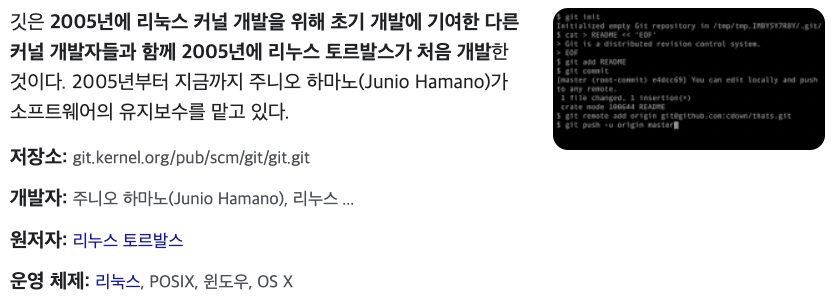

# Git

---

## Git 의 시작

> Git 을 공부하면서 놀랐던 것은 리눅스 개발자로 알려진 `리누스 토발즈` 가 Git 을 개발했다는 사실이다.

[사진 1](./#footnote_1)

일반적으로 협업을 통해 하나의 프로젝트를 진행 때, 각자가 개발한 부분을 일일이 조합하는 것은 엄청난 비용이 필요하다. 그래서 많은 개발자들은 소스관리 혹은 버전관리 프로그램을 사용해왔다.

리눅스 커널의 개발자들은 2002년부터 프로젝트를 관리하는 소스 관리 시스템(SCM)으로 비트키퍼를 사용했다. 그런데 비트키퍼의 저작권을 가지고 있던 래리 맥보이(Larry McVoy)는 앤드루 트리젤이 비트키퍼 프로토콜을 리버스 엔지니어링하여 소스풀러(SourcePuller)를 만들었다고 주장하면서, 비트키퍼의 자유 이용을 철회했다.

그에 따라 많은 개발자들이 비트키퍼의 이용을 포기하게 되면서 2005년 4월부터 Git 개발이 시작되었다.

### Git 은 오픈소스

Git 은 `GNU GPL (General Public License)` 을 따른다. GPL 을 따르는 소프트웨어들은 기본적으로 2차, 3차 창족물들에 대해 모든 소스코드를 공개하도록 돼있다. 즉, Git 은 `오픈소스 소프트웨어`이다.

---

## Git? Github?

앞서 말했듯이 Git 은 오픈소스 소스관리 소프트웨어이다. 그렇다면 Github 는 무엇일까? 
Github 는 협업을 위해 각 개발자들이 짜놓은 소스코드들을 집약하고 관리할 수 있는 소스코드 저장소이다. 
(hub: 중심지, 중추)

### Github 은 오픈소스가 아니다.

Github 에서 제공하는 서비스들은 Git 과 달리 오픈소스가 아니다. Github 는 GPL 이 아닌 Mit Licence 를 따른다. Mit License 따르는 소프트웨어는 무료 배포된 소스코드에 대한 2차 창작물들에 대해 공개 의무를 갖지 않는다.

---

## 참고

-   참고로 오픈소스와 무료는 별개의 개념이다.
-   Github 은 2018 년도에 마이크로 소프트 사에 의해 인수되었다.

---

## 참고문서

-   <a name="footnote_1">[위키백과 - git](<https://ko.wikipedia.org/wiki/%EA%B9%83\_(%EC%86%8C%ED%94%84%ED%8A%B8%EC%9B%A8%EC%96%B4)>)</a>
